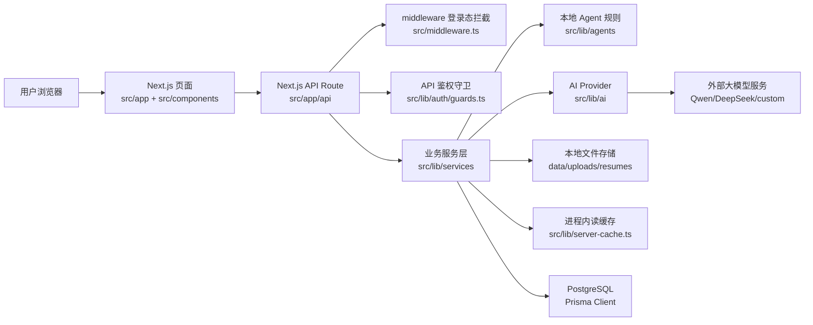
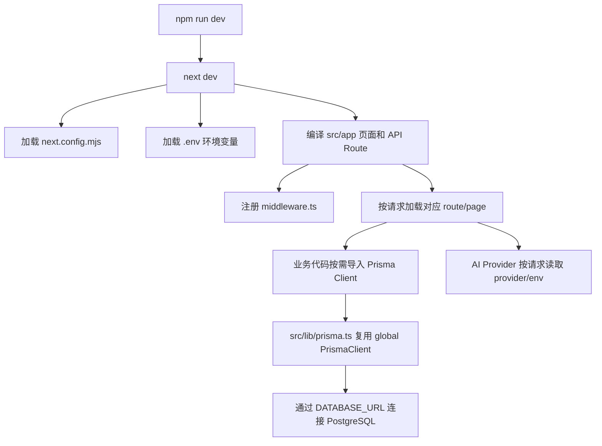
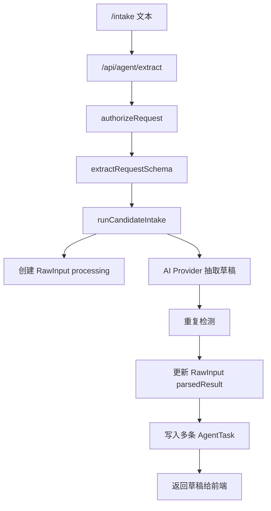
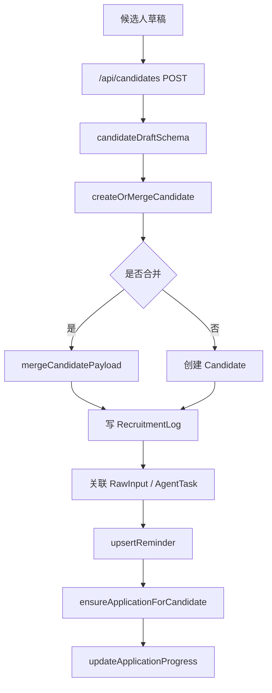
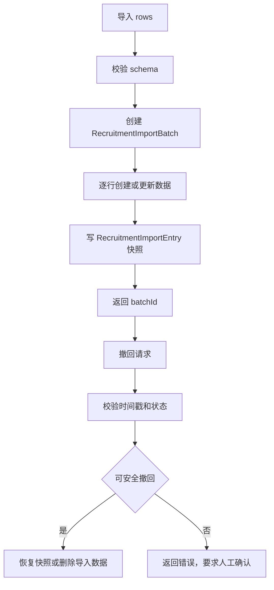
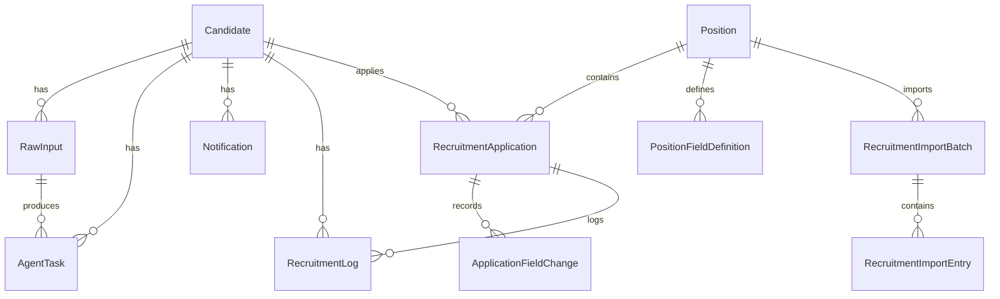
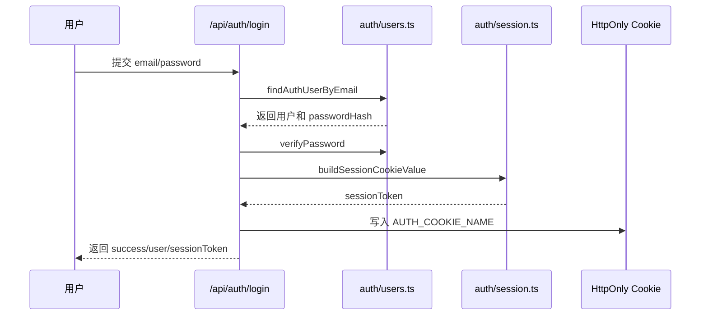

# 代码流程说明文档

## 1. 项目整体架构

Testin RecruitFlow Agent 是一个 Next.js 前后端一体项目。页面、API、中间件、服务层和数据库访问都在同一仓库中，通过 Prisma 访问 PostgreSQL。AI 能力通过统一 Provider 接口接入 mock、Qwen、DeepSeek 或 custom OpenAI-compatible 服务。



架构分层：

| 层级 | 职责 | 主要位置 |
| --- | --- | --- |
| 页面层 | 展示页面、收集用户输入、触发 API | `src/app/*/page.tsx`、`src/components` |
| API 层 | HTTP 入口、登录态/权限校验、参数校验、响应 JSON | `src/app/api/**/route.ts` |
| 业务服务层 | 事务、状态流转、导入撤回、缓存失效、数据编排 | `src/lib/services` |
| AI/Agent 层 | 模型调用、本地抽取、重复检测、标签、跟进建议 | `src/lib/ai`、`src/lib/agents` |
| 数据访问层 | Prisma Client 和 PostgreSQL 数据模型 | `src/lib/prisma.ts`、`prisma/schema.prisma` |
| 文件层 | 上传文件解析、存储、读取、删除 | `src/lib/files`、`data/uploads/resumes` |
| 鉴权层 | Session Token、Cookie、中间件、角色权限 | `src/lib/auth`、`src/middleware.ts` |

当前代码未发现独立后端服务、Redis、消息队列、Docker 容器编排或 CI/CD 配置。

## 2. 项目目录与模块职责

| 模块或目录 | 核心职责 | 主要文件 | 与其他模块的关系 |
| --- | --- | --- | --- |
| `src/app` | 页面和 API 路由 | `page.tsx`、`api/**/route.ts` | 页面调用 API；API 调用服务层 |
| `src/components/intake` | AI 智能录入前端交互 | `intake-workbench.tsx`、`batch-resume-intake.tsx` | 调用 `/api/agent/extract` 和 `/api/agent/extract-file` |
| `src/components/candidates` | 候选人列表和详情交互 | `candidate-management-table.tsx`、`candidate-detail-panel.tsx` | 调用候选人 API，展示 Candidate/RawInput/AgentTask |
| `src/components/positions` | 岗位、进度表、JD、字段配置 | `position-progress-table.tsx`、`position-field-editor.tsx` | 调用岗位 API 和申请进度 API |
| `src/lib/services/intake.ts` | AI Intake 主编排 | `runCandidateIntake` | 调用 AI Provider、重复检测、RawInput、AgentTask |
| `src/lib/services/candidates.ts` | 候选人保存、合并、列表、详情、提醒 | `createOrMergeCandidate`、`updateCandidate` | 调用岗位申请服务和本地 Agent 规则 |
| `src/lib/services/positions.ts` | 岗位、字段、申请进度、导入撤回 | `ensureApplicationForCandidate`、`updateApplicationProgress` | 被候选人保存、岗位页面、导入 API 调用 |
| `src/lib/services/raw-inputs.ts` | 原始输入回溯和文件清理 | `listRawInputs`、`batchUpdateRawInputs` | 关联 RawInput、AgentTask、Candidate、附件 |
| `src/lib/services/dashboard-import.ts` | Dashboard 汇总数据导入和撤回 | `importDashboardProcessData`、`undoDashboardImportBatches` | 写入 Position/Candidate/Application/Log/ImportBatch |
| `src/lib/agents/extract.ts` | 本地抽取、重复检测、合并、提醒规则 | `extractCandidateDraft`、`findDuplicateHint`、`mergeCandidatePayload` | mock provider 和真实模型兜底依赖 |
| `src/lib/ai` | Provider 工厂、真实模型调用、prompt、schema | `provider.ts`、`openai-compatible.ts`、`mock.ts` | 为 Intake 服务输出统一候选人草稿 |
| `src/lib/auth` | 登录、用户、权限、Session | `session.ts`、`guards.ts`、`users.ts`、`permissions.ts` | middleware 和 API Route 依赖 |
| `src/lib/files` | 文件解析和本地存储 | `parser.ts`、`storage.ts` | 文件 Intake 和附件下载接口依赖 |
| `prisma` | 数据模型、迁移、seed | `schema.prisma`、`seed.js`、`migrations` | Prisma Client 生成和数据库初始化依据 |
| `scripts` | 运维脚本 | `start-local-postgres.mjs`、`bootstrap-admin.js`、`predeploy-check.js` | 本地启动、账号初始化、部署前检查 |

## 3. 项目启动流程

启动命令：

```bash
npm run dev
```

启动链路：



关键点：

- Next.js 默认监听 `3000` 端口。
- `.env` 由 Next.js 运行时加载。
- Prisma Client 需要提前通过 `npm run prisma:generate` 或 `prisma generate` 生成。
- 数据库结构通过 `prisma migrate deploy` 应用。
- 当前未发现后台定时任务、消息消费者或独立 worker。
- 当前未发现 Redis 连接初始化。

## 4. 核心业务流程说明

### 4.1 文本 AI 智能录入流程

**业务目标：** 将用户粘贴的简历、邮件、聊天或备注文本转成候选人草稿，并保留 AI 处理日志。

**入口位置：**

- API：`src/app/api/agent/extract/route.ts`
- 服务：`src/lib/services/intake.ts`

**涉及模块：**

- `authorizeRequest`
- `extractRequestSchema`
- `runCandidateIntake`
- `getAIProvider`
- `findDuplicateHint`
- `listDuplicateCandidates`
- Prisma `RawInput`、`AgentTask`

**执行步骤：**

1. 前端在 `/intake` 提交 `content`、`departmentId`、`positionId`、`provider`、`inputTypeHint`。
2. API 调用 `authorizeRequest(request, PERMISSIONS.AI_INTAKE_USE)` 校验登录和权限。
3. API 使用 `extractRequestSchema` 校验参数。
4. `runCandidateIntake` 校验部门和岗位必须存在且匹配。
5. 查询目标岗位、部门、JD 和 AI 可抽取的岗位字段。
6. 创建 RawInput，`parsedResult.status` 初始为 `processing`。
7. `getAIProvider` 根据请求 provider 或 `AI_PROVIDER` 选择 mock、Qwen、DeepSeek 或 custom。
8. Provider 返回 `ExtractedCandidateDraft`。
9. `findDuplicateHint` 在现有候选人中寻找疑似重复。
10. 事务内更新 RawInput，并创建 extract、classify、tagging、followup、duplicate、status 多条 AgentTask。
11. 返回候选人草稿、重复提示、provider 名称、岗位上下文和可填自定义字段。

**数据流转：**



**异常处理：**

- 参数错误返回 400。
- 未登录返回 401。
- 无权限返回 403。
- AI 调用失败时，RawInput 更新为 failed，并写入 FAILED AgentTask。

**关键代码位置：**

- `src/app/api/agent/extract/route.ts`
- `src/lib/services/intake.ts`
- `src/lib/ai/provider.ts`
- `src/lib/ai/providers/openai-compatible.ts`
- `src/lib/agents/extract.ts`

### 4.2 文件 AI 智能录入流程

**业务目标：** 将上传文件解析成文本并复用 AI Intake 主流程。

**入口位置：**

- API：`src/app/api/agent/extract-file/route.ts`
- 文件解析：`src/lib/files/parser.ts`
- 文件存储：`src/lib/files/storage.ts`

**执行步骤：**

1. 前端提交 `multipart/form-data`，包含 `file`、`provider`、`departmentId`、`positionId`。
2. API 校验 `AI_INTAKE_USE` 权限。
3. `parseUploadedFile` 校验文件名、大小和类型。
4. 按文件类型提取文本：
   - PDF：`pdf-parse`
   - DOCX：`mammoth`
   - TXT/MD/JSON/CSV：文本解码
5. `storeResumeUpload` 将原文件保存到 `data/uploads/resumes`。
6. `buildIntakeContentFromFile` 给模型输入追加文件名、文件类型和场景提示。
7. 调用 `runCandidateIntake`。
8. 如果 AI 流程失败，调用 `removeStoredResume` 删除刚落盘文件。
9. 成功后返回候选人草稿、解析文本和附件下载 URL。

**异常处理：**

- 文件为空、超过 8MB、类型不支持或无可用文本时返回 400。
- AI 失败会清理附件，避免孤儿文件。

**关键代码位置：**

- `src/app/api/agent/extract-file/route.ts`
- `src/lib/files/parser.ts`
- `src/lib/files/storage.ts`
- `src/lib/services/intake.ts`

### 4.3 候选人保存与合并流程

**业务目标：** 用户确认候选人草稿后，创建新候选人或合并到已有候选人。

**入口位置：**

- API：`src/app/api/candidates/route.ts`
- 服务：`src/lib/services/candidates.ts`

**执行步骤：**

1. 前端提交候选人草稿和可选的 `duplicateMatchId`、`rawInputId`、`targetPositionId`。
2. API 校验 `CANDIDATE_WRITE` 权限。
3. `candidateDraftSchema` 校验姓名、手机号、邮箱、状态、标签、自定义字段等。
4. `createOrMergeCandidate` 在事务内执行保存。
5. 若存在 `duplicateMatchId` 或 RawInput 已关联候选人，则读取已有候选人并调用 `mergeCandidatePayload`。
6. 合并策略：
   - 已有字段优先。
   - 技能、标签、缺失字段去重合并。
   - 状态只向更靠后的招聘阶段推进。
7. 新建或合并后写入 RecruitmentLog。
8. `syncIntakeAssociations` 将 RawInput 和 AgentTask 关联到候选人。
9. `upsertReminder` 创建或更新未完成提醒。
10. 事务外调用 `ensureApplicationForCandidate` 创建或更新岗位申请。
11. 如有岗位自定义字段，调用 `updateApplicationProgress` 写入申请字段。
12. 清理 candidates、rawInputs、agentTasks、dashboard 缓存。

**数据流转：**



**异常处理：**

- 目标岗位不存在或已删除会抛错。
- 候选人 schema 校验失败返回 400。

**关键代码位置：**

- `src/app/api/candidates/route.ts`
- `src/lib/services/candidates.ts`
- `src/lib/agents/extract.ts`
- `src/lib/services/positions.ts`

### 4.4 岗位与岗位申请进度流程

**业务目标：** 管理岗位、岗位字段和候选人在岗位下的申请进度。

**入口位置：**

- API：`src/app/api/positions/route.ts`
- API：`src/app/api/applications/[id]/route.ts`
- 服务：`src/lib/services/positions.ts`

**执行步骤：**

1. 管理员通过 `/positions` 创建岗位。
2. `createPositionSchema` 校验岗位名称、部门、HC、状态、优先级、JD。
3. `createPosition` 创建 Position。
4. `ensureDefaultPositionFields` 为岗位初始化默认字段。
5. Intake 保存候选人或手工编辑时，`ensureApplicationForCandidate` upsert RecruitmentApplication。
6. `updateApplicationProgress` 更新申请状态和自定义字段。
7. 状态变化时写入 RecruitmentLog。
8. 字段变化时写入 ApplicationFieldChange。

**关键边界：**

- Candidate 表代表人才库。
- RecruitmentApplication 表代表候选人在某个岗位下的流程。
- `candidateId + positionId` 在数据库中唯一。
- 系统字段不能被删除。

**关键代码位置：**

- `src/lib/services/positions.ts`
- `src/lib/schemas/positions.ts`
- `prisma/schema.prisma`

### 4.5 导入与撤回流程

**业务目标：** 支持岗位进度表或 Dashboard 汇总数据导入，并允许在安全条件下撤回。

**入口位置：**

- 岗位进度导入：`src/app/api/positions/[id]/import/route.ts`
- 岗位进度撤回：`src/app/api/positions/[id]/import/[batchId]/undo/route.ts`
- Dashboard 过程导入：`src/app/api/dashboard/process-data/import/route.ts`
- Dashboard 需求导入：`src/app/api/dashboard/demand-progress/import/route.ts`
- Dashboard 撤回：`src/app/api/dashboard/import/undo/route.ts`

**执行步骤：**

1. API 校验权限和导入 schema。
2. 服务层创建 RecruitmentImportBatch。
3. 对每条导入行执行 CREATE 或 UPDATE。
4. 写入 RecruitmentImportEntry，保存变更前快照或导入后时间戳。
5. 撤回时读取批次和明细。
6. 校验导入后的 candidate/application/position 是否被再次修改。
7. 未被修改时回滚；已被修改时拒绝撤回。

**数据流转：**



**关键代码位置：**

- `src/lib/services/positions.ts`
- `src/lib/services/dashboard-import.ts`
- `prisma/schema.prisma`

## 5. 请求处理链路

一次需要权限的请求通常经过：

```text
前端组件
-> Next.js API Route
-> middleware 登录态保护
-> authorizeRequest 权限校验
-> Zod schema 参数校验
-> services 业务处理
-> Prisma 数据库操作 / AI Provider / 文件存储
-> NextResponse.json 返回
```

| 处理项 | 位置 | 说明 |
| --- | --- | --- |
| 路由匹配 | `src/app/api/**/route.ts` | Next.js App Router 自动匹配 |
| 登录态保护 | `src/middleware.ts` | 非公开页面/API 需要有效 Session Cookie |
| 权限校验 | `src/lib/auth/guards.ts` | API Route 显式调用 `authorizeRequest` |
| 权限定义 | `src/lib/auth/permissions.ts` | `admin` 全权限，`recruiter` 仅部分写权限 |
| 参数校验 | `src/lib/schemas` 或 API 内部 zod schema | 入参错误返回 400 |
| 业务事务 | `src/lib/services/*` | 使用 `prisma.$transaction` 控制一致性 |
| AI 调用日志 | `src/lib/services/intake.ts` | 写入 AgentTask |
| 响应封装 | 各 API Route | 使用 `NextResponse.json`，未发现全局响应封装 |
| 异常处理 | 各 API Route catch 块 | 未发现全局异常处理器 |
| 读缓存 | `src/lib/server-cache.ts` | 服务层按 key/prefix 缓存和失效 |

## 6. 数据模型与数据流说明

核心数据表：

| 模型 | 核心字段 | 关系 |
| --- | --- | --- |
| `Candidate` | 姓名、电话、邮箱、学校、学历、专业、技能、状态、标签、跟进建议、positionId | 关联 Position、RawInput、AgentTask、Notification、RecruitmentApplication |
| `Position` | 标题、部门、HC、JD、招聘状态、优先级 | 关联 Candidate、RecruitmentApplication、PositionFieldDefinition、ImportBatch |
| `RecruitmentApplication` | candidateId、positionId、status、owner、appliedAt、customValues | Candidate 与 Position 的岗位申请关系 |
| `RawInput` | inputType、inputScene、content、parsedResult、candidateId、applicationId | 保存原文和 AI 解析结果 |
| `AgentTask` | agentName、taskType、status、input、output、error、confidence | 记录 AI 子任务 |
| `RecruitmentLog` | candidateId、applicationId、fromStatus、toStatus、note | 记录状态流转 |
| `Notification` | type、title、note、dueAt、done、candidateId | 跟进提醒 |
| `PositionFieldDefinition` | key、label、fieldType、scope、aiExtractable、conflictPolicy | 岗位自定义字段 |
| `ApplicationFieldChange` | applicationId、fieldKey、oldValue、newValue、source | 申请字段变更历史 |
| `RecruitmentImportBatch` | positionId、status、createdBy、undoneAt | 导入批次 |
| `RecruitmentImportEntry` | batchId、action、快照、应用时间戳 | 导入明细和撤回依据 |
| `AuthUser` | name、email、passwordHash、role | 登录用户 |

实体关系概览：



接口到数据库的数据变化示例：

1. `/api/agent/extract-file` 接收文件。
2. 文件保存到 `data/uploads/resumes`。
3. RawInput 保存原文和 `storedFileName`。
4. AgentTask 保存 AI 子任务。
5. `/api/candidates` 保存候选人。
6. Candidate 创建或更新。
7. RecruitmentApplication upsert。
8. RecruitmentLog 和 Notification 写入。

## 7. 配置与环境变量加载流程

配置来源：

- `.env.example`：模板。
- `.env`：本地实际配置。
- `process.env`：运行时代码读取。
- `next.config.mjs`：Next.js 配置。
- `prisma/schema.prisma`：数据库 provider 和 `DATABASE_URL` 引用。

加载和使用：

| 配置 | 读取位置 | 影响 |
| --- | --- | --- |
| `DATABASE_URL` | Prisma datasource | 数据库连接失败会导致 API 和页面查询失败 |
| `AUTH_SECRET` | `src/lib/auth/session.ts` | 改变后旧 Session Token 会失效 |
| `AI_PROVIDER` | `src/lib/ai/provider.ts` | 决定默认模型 provider |
| `QWEN_*` | `src/lib/ai/provider.ts` | Qwen 调用配置 |
| `DEEPSEEK_*` | `src/lib/ai/provider.ts` | DeepSeek 调用配置 |
| `CUSTOM_AI_*` | `src/lib/ai/provider.ts` | custom provider 调用配置 |
| `NEXT_PUBLIC_APP_NAME` | 前端代码可读取 | 应用展示名称 |

Provider 优先级：

1. API 请求传入 provider。
2. `.env` 中 `AI_PROVIDER`。
3. 默认 `mock`。

敏感配置注意事项：

- `.env` 不应提交真实密钥。
- `.env.example` 只应保留示例和占位值。
- 生产环境必须设置稳定且随机的 `AUTH_SECRET`。

## 8. 异常处理与日志流程

当前项目未发现全局异常处理器，各 API Route 使用局部 `try/catch` 返回 JSON 错误。

| 异常来源 | 处理位置 | 返回或记录方式 |
| --- | --- | --- |
| 参数校验失败 | API Route catch | 返回 400 JSON |
| 未登录 | `middleware.ts` / `authorizeRequest` | 页面重定向，API 返回 401 |
| 无权限 | `authorizeRequest` | 返回 403 JSON |
| AI 调用失败 | `runCandidateIntake` catch | RawInput 标记 failed，AgentTask 记录 FAILED 和 error |
| 文件解析失败 | `parseUploadedFile` / API catch | 返回 400 JSON |
| 导入撤回不安全 | service 抛错，API catch | 返回 400 JSON |
| Prisma 错误 | service 抛错，API catch | 返回错误 message |

日志形式：

- 业务日志主要落在数据库表 `AgentTask`、`RecruitmentLog`、`ApplicationFieldChange`、`RecruitmentImportEntry`。
- Prisma Client 开发模式只配置 `error` 和 `warn` 日志。
- 当前未发现独立日志框架。

排查优先级：

1. 浏览器页面错误提示。
2. API 响应 JSON。
3. `/agent-tasks` 的 `error` 字段。
4. 终端 Next.js 输出。
5. 数据库中的 RawInput、AgentTask、RecruitmentLog。

## 9. 鉴权、权限和安全流程

### 9.1 登录流程



### 9.2 Session 校验

- Token 结构为 `payload.signature`。
- payload 为 Base64URL 编码 JSON，包含 user 和 expiresAt。
- signature 使用 `AUTH_SECRET` 做 HMAC-SHA256。
- `verifySessionToken` 校验结构、签名和过期时间。
- `getAuthenticatedUser` 会根据 token 中 user.id 再查数据库，确保用户仍存在。

### 9.3 权限控制

| 角色 | 权限 |
| --- | --- |
| `admin` | 全部权限 |
| `recruiter` | AI Intake、申请写入、候选人写入、原始输入写入 |

权限常量位于 `src/lib/auth/permissions.ts`。API Route 根据操作传入不同权限，例如：

- AI Intake：`PERMISSIONS.AI_INTAKE_USE`
- 候选人保存：`PERMISSIONS.CANDIDATE_WRITE`
- 候选人删除：`PERMISSIONS.CANDIDATE_DELETE`
- 岗位管理：`PERMISSIONS.POSITION_MANAGE`
- 用户管理：`PERMISSIONS.USER_MANAGE`

### 9.4 未登录和无权限处理

- 页面请求未登录：`middleware.ts` 重定向到 `/login?from=原路径`。
- API 请求未登录：返回 401 JSON。
- API 请求无权限：返回 403 JSON。

### 9.5 安全注意事项

- 文件读取使用 `path.basename` 和目录前缀检查，降低路径穿越风险。
- 密码使用 scrypt 加盐哈希，不保存明文。
- Session Cookie 使用 `httpOnly`、`sameSite=lax`，生产环境 `secure=true`。
- `AUTH_SECRET` 不稳定会导致登录态全部失效。

## 10. 外部依赖与第三方服务说明

| 外部服务 | 用途 | 配置位置 | 调用入口 | 失败影响 | 排查方式 |
| --- | --- | --- | --- | --- | --- |
| PostgreSQL | 主数据库 | `DATABASE_URL` | Prisma Client、所有服务层 | 页面和 API 查询/写入失败 | 检查数据库是否启动、连接串是否正确、迁移是否执行 |
| Qwen | AI 候选人抽取 | `QWEN_API_KEY`、`QWEN_MODEL`、`QWEN_BASE_URL` | `OpenAICompatibleAIProvider` | AI Intake 失败，AgentTask 记录 error | 查看 `/agent-tasks` 和环境变量 |
| DeepSeek | AI 候选人抽取 | `DEEPSEEK_API_KEY`、`DEEPSEEK_MODEL`、`DEEPSEEK_BASE_URL` | `OpenAICompatibleAIProvider` | AI Intake 失败，AgentTask 记录 error | 查看 `/agent-tasks` 和环境变量 |
| custom OpenAI-compatible 服务 | AI 候选人抽取 | `CUSTOM_AI_*` | `OpenAICompatibleAIProvider` | AI Intake 失败，AgentTask 记录 error | 检查 API Key、base URL、model 和网络 |
| 本地文件系统 | 保存上传简历 | 固定目录 `data/uploads/resumes` | `src/lib/files/storage.ts` | 附件无法读取或删除 | 检查目录权限和文件是否存在 |
| Redis | 未发现使用 | 不适用 | 不适用 | 不适用 | 当前无需排查 |
| 消息队列 | 未发现使用 | 不适用 | 不适用 | 不适用 | 当前无需排查 |
| 对象存储 | 未发现使用 | 不适用 | 不适用 | 不适用 | 当前无需排查 |

## 11. 关键代码阅读顺序建议

1. [README.md](../README.md)：先理解项目定位、快速启动和功能地图。
2. [docs/01_项目操作使用文档.md](01_项目操作使用文档.md)：按步骤跑通项目。
3. `package.json`：确认真实脚本和依赖。
4. `.env.example`：理解配置项。
5. `prisma/schema.prisma`：理解数据模型和表关系。
6. `src/middleware.ts`：理解全局登录态保护。
7. `src/lib/auth/session.ts`、`src/lib/auth/guards.ts`、`src/lib/auth/permissions.ts`：理解登录和权限。
8. `src/app/api/agent/extract/route.ts`、`src/app/api/agent/extract-file/route.ts`：理解 AI Intake API 入口。
9. `src/lib/services/intake.ts`：理解 AI Intake 服务端主流程。
10. `src/lib/ai/provider.ts`、`src/lib/ai/providers/openai-compatible.ts`、`src/lib/ai/providers/mock.ts`：理解模型接入。
11. `src/lib/agents/extract.ts`：理解本地抽取、重复检测和合并规则。
12. `src/app/api/candidates/route.ts`、`src/lib/services/candidates.ts`：理解候选人保存和合并。
13. `src/lib/services/positions.ts`：理解岗位、申请进度、自定义字段和导入撤回。
14. `src/lib/services/raw-inputs.ts`、`src/lib/files/parser.ts`、`src/lib/files/storage.ts`：理解原始输入和文件处理。
15. `src/components/intake`、`src/components/candidates`、`src/components/positions`：再阅读前端交互细节。

## 12. 待确认项与潜在风险

| 编号 | 待确认项或风险 | 涉及位置 | 原因 | 建议确认方式 |
| --- | --- | --- | --- | --- |
| 1 | 自动化测试缺失 | `package.json` | 未发现 `test` 脚本或测试框架配置 | 明确是否需要补充单元测试/集成测试方案 |
| 2 | Docker 部署缺失 | 仓库根目录 | 未发现 Dockerfile 或 docker-compose | 若需要容器部署，应新增并验证配置 |
| 3 | 进程内缓存不跨实例共享 | `src/lib/server-cache.ts` | 多实例部署时缓存不会同步 | 生产多实例场景评估是否引入外部缓存 |
| 4 | 上传文件使用本地磁盘 | `data/uploads/resumes` | 部署到无持久磁盘或多实例时文件可能丢失或不一致 | 生产部署前确认是否迁移到对象存储 |
| 5 | 部分业务字符串存在乱码 | `src/lib/agents/extract.ts`、`src/lib/services/positions.ts` 等 | 静态阅读发现若干提示文案/正则包含乱码 | 单独评估编码修复，不应混入注释文档任务 |
| 6 | Dashboard 汇总导入会生成占位候选人 | `src/lib/services/dashboard-import.ts` | 汇总数据没有候选人明细，只能生成演示用候选人 | 业务侧确认该行为是否符合生产使用预期 |
| 7 | `AUTH_SECRET` 开发兜底值不适合生产 | `src/lib/auth/session.ts` | 未配置时会使用固定开发默认值 | 部署前强制配置生产密钥 |
| 8 | 当前未发现统一异常处理中间件 | `src/app/api/**/route.ts` | 各 API 独立 catch，错误格式可能不完全统一 | 后续可评估抽象统一错误响应工具 |
| 9 | 本地 PostgreSQL 固定 5432 | `scripts/start-local-postgres.mjs` | 端口被占用时脚本无法自动换端口 | 本地开发前确认 5432 可用或改用外部数据库 |

