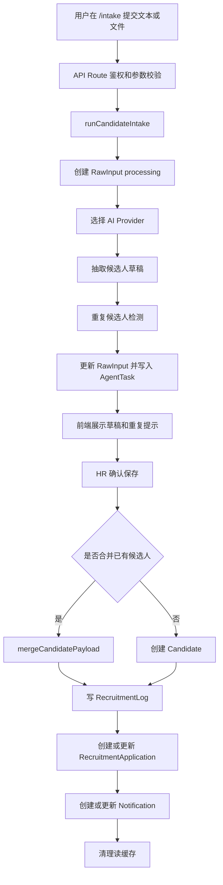

# Testin RecruitFlow Agent 代码流程说明文档

本文面向需要阅读、维护和二次开发代码的新同学，说明项目分层、核心数据模型和一次候选人智能录入的完整代码路径。

## 1. 技术栈

- Next.js 15：页面、Server Component、API Route 和中间件。
- React 19：前端交互组件。
- Prisma 6：数据库 ORM。
- PostgreSQL：运行时数据库。
- OpenAI SDK：接入 Qwen、DeepSeek 或其他兼容 OpenAI 协议的模型。
- pdf-parse、mammoth：PDF 和 DOCX 文本解析。
- zod：接口入参和 AI 输出结构校验。
- Recharts：Dashboard 图表。

## 2. 目录职责

| 路径 | 职责 |
| --- | --- |
| `src/app` | Next.js App Router 页面和 API 路由 |
| `src/components` | 可复用前端组件 |
| `src/lib/services` | 服务层，封装候选人、岗位、Dashboard、Intake 等业务操作 |
| `src/lib/agents` | 本地抽取、重复检测、合并策略、提醒建议等 Agent 相关规则 |
| `src/lib/ai` | AI Provider、提示词、模型输出 schema 和岗位匹配逻辑 |
| `src/lib/auth` | 登录态、权限、用户校验 |
| `src/lib/files` | 上传文件存储和文本解析 |
| `src/lib/schemas` | API 请求参数 schema |
| `prisma` | 数据模型、迁移和种子脚本 |
| `scripts` | 本地数据库、演示数据、账号初始化和部署检查脚本 |
| `data` | 演示数据源和上传文件目录 |

## 3. 核心数据模型

### 3.1 Candidate

候选人人才库主表，保存姓名、联系方式、学校、专业、技能、标签、当前状态、跟进建议等信息。候选人可以关联一个当前岗位，也可以通过 RecruitmentApplication 参与多个岗位流程。

### 3.2 Position

招聘岗位表，保存岗位名称、部门、JD、招聘状态、优先级、自定义字段和导入批次。Intake 时必须选择部门和岗位，AI 会把岗位上下文带入抽取提示词。

### 3.3 RecruitmentApplication

候选人在某个岗位下的申请记录。Candidate 表偏人才库，RecruitmentApplication 表偏岗位流程。系统通过 `candidateId + positionId` 保证同一候选人在同一岗位下只有一条申请。

### 3.4 RawInput

原始输入回溯表，保存用户粘贴的文本或上传文件解析后的原文，以及 AI 解析结果快照。即使 AI 失败，也会写入 RawInput，方便排查。

### 3.5 AgentTask

Agent 执行日志表，记录抽取、分类、标签、重复检测、跟进建议和状态识别等子任务。页面 `/agent-tasks` 直接读取这些记录。

### 3.6 RecruitmentLog

状态流转日志，记录候选人从一个招聘阶段推进到另一个阶段的历史。

### 3.7 Notification

跟进提醒表，根据候选人的状态和跟进建议生成待办。

## 4. 请求鉴权流程

相关文件：

- `src/middleware.ts`
- `src/lib/auth/session.ts`
- `src/lib/auth/guards.ts`
- `src/lib/auth/permissions.ts`

流程：

1. `middleware.ts` 拦截页面和 API 请求。
2. 登录、注册、认证 API、静态资源等公开路径直接放行。
3. 其他请求读取认证 cookie，并通过 `verifySessionToken` 校验登录态。
4. 页面请求未登录时跳转 `/login?from=原路径`。
5. API 请求未登录时返回 401 JSON。
6. API Route 内部调用 `authorizeRequest` 做二次校验。
7. 如果接口要求特定权限，`hasPermission` 根据用户角色判断是否允许执行。

## 5. 文本智能录入流程

入口文件：

- `src/app/api/agent/extract/route.ts`

核心服务：

- `src/lib/services/intake.ts`

流程：

1. 前端在 `/intake` 页面提交文本、部门、岗位和 provider。
2. API Route 调用 `authorizeRequest` 校验 `AI_INTAKE_USE` 权限。
3. API Route 使用 `extractRequestSchema` 校验请求参数。
4. API Route 调用 `runCandidateIntake`。
5. `runCandidateIntake` 校验部门和岗位必须存在且匹配。
6. 系统查询岗位 JD 和 AI 可抽取的岗位自定义字段。
7. 系统创建 RawInput，状态先标记为 processing。
8. 系统根据 provider 参数或环境变量调用 `getAIProvider`。
9. Provider 抽取候选人草稿。
10. 系统调用 `listDuplicateCandidates` 获取候选人池。
11. 系统调用 `findDuplicateHint` 生成疑似重复提示。
12. 系统在事务内更新 RawInput，并创建多条 AgentTask。
13. 服务层返回候选人草稿、重复提示、岗位上下文和自定义字段定义。
14. 前端展示结果，等待 HR 确认保存。

## 6. 文件智能录入流程

入口文件：

- `src/app/api/agent/extract-file/route.ts`

相关文件：

- `src/lib/files/parser.ts`
- `src/lib/files/storage.ts`
- `src/lib/services/intake.ts`

流程：

1. 前端上传文件、部门、岗位和 provider。
2. API Route 校验权限。
3. `parseUploadedFile` 检查文件名、大小、类型和内容。
4. 系统按类型解析文本：
   - PDF 使用 `pdf-parse`。
   - DOCX 使用 `mammoth`。
   - TXT、MD、JSON、CSV 使用文本解码。
5. `buildIntakeContentFromFile` 给模型内容追加文件名、文件类型、输入类型提示和场景提示。
6. `storeResumeUpload` 保存上传文件。
7. API Route 调用 `runCandidateIntake`，后续流程与文本录入一致。
8. 如果 AI 处理失败，接口会删除刚保存的文件，避免产生孤儿附件。
9. 成功后接口返回候选人草稿、解析文本和文件访问地址。

## 7. AI Provider 流程

相关文件：

- `src/lib/ai/provider.ts`
- `src/lib/ai/providers/openai-compatible.ts`
- `src/lib/ai/providers/mock.ts`
- `src/lib/ai/prompts.ts`
- `src/lib/ai/schemas.ts`
- `src/lib/agents/extract.ts`

Provider 选择顺序：

1. API 请求中传入的 provider。
2. `.env` 中的 `AI_PROVIDER`。
3. 默认回退到 `mock`。

真实模型调用流程：

1. `getAIProvider` 根据 provider 创建 OpenAI-compatible provider。
2. `OpenAICompatibleAIProvider.extractCandidate` 拼装系统提示词和用户提示词。
3. 模型以 JSON object 格式返回候选人字段。
4. `extractJsonObject` 从模型文本中截取完整 JSON。
5. `extractCandidateDraft` 同步生成一份本地规则草稿。
6. 系统用模型结果覆盖本地草稿，模型漏字段时保留本地兜底值。
7. `llmCandidateExtractSchema` 使用 zod 校验最终结构。
8. 如果模型返回异常，最多重试一次。

mock provider 用于无 API Key 的本地演示，主要依赖 `src/lib/agents/extract.ts` 中的本地规则。

## 8. 候选人保存和合并流程

核心文件：

- `src/lib/services/candidates.ts`
- `src/lib/agents/extract.ts`
- `src/lib/services/positions.ts`

流程：

1. 前端在 Intake 结果页点击保存。
2. 服务层调用 `createOrMergeCandidate`。
3. 系统根据 `duplicateMatchId` 或 RawInput 已有关联判断是否合并。
4. 如果合并：
   - 读取已有候选人。
   - 调用 `mergeCandidatePayload` 合并字段。
   - 已有人工维护字段优先。
   - 技能、标签、缺失字段去重合并。
   - 招聘状态只向更靠后的阶段推进。
   - 创建 RecruitmentLog。
   - 关联 RawInput 和 AgentTask。
5. 如果新建：
   - 创建 Candidate。
   - 创建第一条 RecruitmentLog。
   - 关联 RawInput 和 AgentTask。
6. 系统调用 `ensureApplicationForCandidate` 创建或更新岗位申请记录。
7. 如果岗位存在自定义字段，系统调用 `updateApplicationProgress` 写入字段值。
8. 系统调用 `upsertReminder` 创建或更新跟进提醒。
9. 系统清理候选人、原始输入、Agent 日志和 Dashboard 相关缓存。

## 9. 重复候选人检测逻辑

核心函数：

- `findDuplicateHint`

规则说明：

- 手机号一致是强信号。
- 邮箱一致是强信号。
- 姓名一致是基础弱信号。
- 姓名同时匹配学校、专业、岗位、工作年限或技能，会累加分数。
- 有手机号或邮箱命中时，阈值更低。
- 只有姓名命中时，阈值更谨慎。
- 没有强身份信息时，需要更高分数才提示重复。

返回结果包括：

- 候选人 ID。
- 候选人姓名。
- 命中原因。
- 分数。
- 当前状态。
- 岗位名称。

## 10. 缓存和刷新机制

相关文件：

- `src/lib/server-cache.ts`
- `src/lib/services/candidates.ts`
- `src/lib/services/intake.ts`
- `src/lib/services/dashboard.ts`

读取列表、详情和 Dashboard 时会使用 `readThroughCache`。写操作完成后会调用 `invalidateCacheByPrefix` 清理相关缓存。

常见缓存前缀：

- `candidates:`
- `rawInputs:`
- `agentTasks:`
- `dashboard:`

新增写操作时，要确认是否需要清理这些前缀，否则页面可能短时间显示旧数据。

## 11. 页面到服务层映射

| 页面或 API | 主要文件 | 说明 |
| --- | --- | --- |
| `/login` | `src/app/login/page.tsx` | 登录页面 |
| `/register` | `src/app/register/page.tsx` | 注册页面 |
| `/dashboard` | `src/app/dashboard/page.tsx` | 招聘总览 |
| `/intake` | `src/app/intake/page.tsx`、`src/components/intake/*` | AI 智能录入 |
| `/candidates` | `src/app/candidates/page.tsx`、`src/components/candidates/*` | 候选人列表和管理 |
| `/candidates/[id]` | `src/app/candidates/[id]/page.tsx` | 候选人详情 |
| `/raw-inputs` | `src/app/raw-inputs/page.tsx`、`src/components/raw-inputs/*` | 原始输入回溯 |
| `/agent-tasks` | `src/app/agent-tasks/page.tsx`、`src/components/agent-tasks/*` | Agent 日志 |
| `/kanban` | `src/app/kanban/page.tsx`、`src/components/kanban/*` | 招聘流程看板 |
| `/admin/users` | `src/app/admin/users/page.tsx`、`src/components/auth/user-management.tsx` | 用户管理 |

## 12. 关键流程图

## 13. 二次开发注意事项

1. 新增 API Route 时，先确认是否需要 `authorizeRequest` 和具体权限。
2. 新增写操作后，检查是否需要清理 `candidates:`、`rawInputs:`、`agentTasks:`、`dashboard:` 缓存。
3. 改动 AI 输出字段时，同时更新 zod schema、Prompt、前端展示和 Prisma 字段。
4. 改动 CandidateStatus 时，同时检查常量、看板列、跟进提醒和状态流转逻辑。
5. 文件解析只负责提取文本，不做业务抽取；业务抽取统一走 Intake。
6. Candidate 和 RecruitmentApplication 不要混用：前者是人才库，后者是岗位流程。
7. 真实模型输出不能直接入库，必须经过 schema 校验和本地兜底合并。
8. 删除候选人默认软删除；如果确实要物理删除，需要同步考虑关联表和审计需求。

